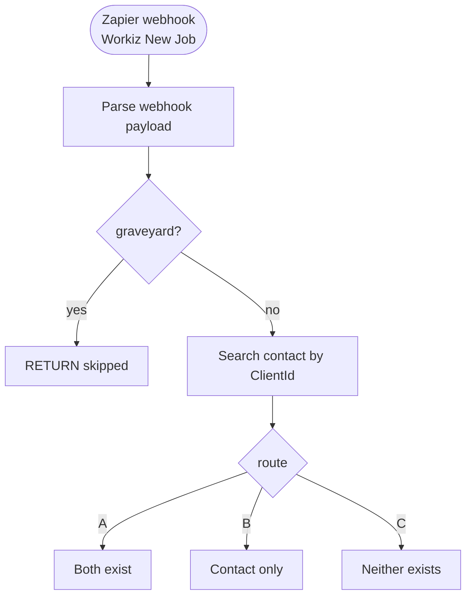

# Phase 3 Flow — Workiz New Job → Odoo SO

**Source:** `1_Production_Code/zapier_phase3_FLATTENED_FINAL.py`
**Trigger:** Zapier webhook fired from Workiz when a new job is created.
**Purpose:** Create the corresponding Sales Order in Odoo, routing through Path A / B / C based on whether the Contact and/or Property already exist. Write `x_studio_next_job_date` on the contact so the reactivation filter excludes them.

---

## Flowchart



_SVG above (tap/click for full pinch-zoom on mobile). High-res PNG is `phase3_flow.png` as fallback. Mermaid source below is live-editable._

**To regenerate after editing the Mermaid source:**

```
cd 3_Documentation/phase_diagrams
npx -p @mermaid-js/mermaid-cli mmdc -i phase3_flow.mmd -o phase3_flow.svg -b white
npx -p @mermaid-js/mermaid-cli mmdc -i phase3_flow.mmd -o phase3_flow.png -b white -w 3200
```



See `phase3_flow.mmd` for the full Mermaid source — the block above is an abbreviated preview for desktop rendering; the SVG/PNG reflect the complete diagram.

---

## Legend

| Style | Meaning |
|---|---|
| 🔴 Red | Hard error — returns `{success: False}` with an error message. Zapier sees this as a failed run. |
| 🟡 Yellow | Early return with `success: True` but skipped (graveyard job for SMS only, or SO already existed). Legitimate exits. |
| 🟠 Orange | **Silent-fail gate.** Code logs a warning and continues. Run looks successful but downstream state is incomplete (next_job_date never written). |
| 🟣 Purple | One of the three execution paths (A / B / C). |
| 🟢 Green | Successful exit. |

---

## Silent-fail gates in Phase 3

Every path (A, B, C) has the same three silent-fail gates on the `write_next_job_date_to_contact` call:

1. **`contact_id` falsy** — if `contact_id` is None or 0, `write_next_job_date_to_contact` silently returns. Could happen if contact creation in Path C returned None (Odoo RPC failure), or if Path A/B reads returned a falsy parent_id.
2. **`job_datetime_str` empty** — if the Workiz payload didn't include `JobDateTime` or it came through as empty, the write is silently skipped.
3. **Odoo write fails** — logs warning, no retry, no dead-letter. Transient Odoo API issues lose the write with zero visibility.

These gates are identical to the ones in Phase 5A. Combined across both phases, this is the root cause surface area for the 18-contact reactivation-filter false-positive investigation (see `BACKLOG.md` §1).

---

## Path routing

The router checks contact + property existence and dispatches:

| Situation | Path |
|---|---|
| Contact (`ref = ClientId`) exists AND a child property matches `service_address` | **Path A** — reuse both, create SO |
| Contact exists but no matching property | **Path B** — create property under contact, then SO |
| Neither contact nor property exists | **Path C** — create contact with `ref = ClientId`, create property under it, then SO |

Path C is the risk path: if Phase 3 runs for a customer whose Odoo contact was created outside the sync pipeline (no `ref` set), it won't match, and Path C will create a **duplicate** contact. Duplicate-risk is worth auditing periodically.

---

## Graveyard filter

Jobs with `JobType = "Reactivation Lead"` and status = `Submitted` / not scheduled are skipped entirely — they're SMS-only placeholders in Workiz, not real jobs. Once a graveyard job gets scheduled (status transitions away from Submitted), Phase 3 treats it as a real job and creates an SO. Phase 4's graveyard-auto-close logic is the complement of this — it handles the moment of transition.

---

## Idempotency

Before doing anything else, Phase 3 searches `sale.order` by `x_studio_x_studio_workiz_uuid = <job_uuid>`. If an SO already exists, Phase 3 returns early with `path: A, already_existed: True`. This prevents duplicate SO creation when Phase 4 delegates to Phase 3 on a job whose SO was created by a parallel run.

---

## Inputs

**Expected from Zapier webhook:**

```json
{
  "job_uuid": "ABC123",
  "ClientId": "1393",
  "customer_name": "Beth Shelton",
  "service_address": "123 Main St",
  "Phone": "7074803008",
  "Email": "...",
  "JobType": "...",
  "Status": "...",
  "SubStatus": "...",
  "JobDateTime": "2026-04-21 21:00:00"
}
```

Required: `job_uuid`, `ClientId`, `service_address`. Missing any → hard error.

---

## Outputs

**Success (Path A/B/C):**

```json
{
  "success": true,
  "sales_order_id": 4153,
  "path": "A" | "B" | "C",
  "contact_id": 23023,
  "property_id": 24958
}
```

**Early return (idempotency):**

```json
{
  "success": true,
  "sales_order_id": 4153,
  "path": "A",
  "already_existed": true
}
```

**Early return (graveyard):**

```json
{
  "success": true,
  "message": "Skipped: Reactivation graveyard job (no SO created)",
  "path": "SKIP"
}
```

---

## External side effects (per run)

Call order per successful run (Path A as example):

1. **Odoo:** `res.partner.search` — find contact by ref
2. **Odoo:** `res.partner.search` — find child property matching address
3. **Odoo:** `sale.order.create` — create SO with `x_studio_x_studio_workiz_uuid`
4. **Odoo:** `sale.order.action_confirm` (if status triggers task creation)
5. **Odoo:** `res.partner.write` — `x_studio_next_job_date` on contact
6. **Odoo chatter:** post message on SO with creation details

Paths B and C add `res.partner.create` calls for new property and/or new contact earlier in the sequence.

---

## Related

- **Phase 4** — delegates to Phase 3 via webhook when it receives a status change for a job whose SO doesn't exist yet
- **Phase 5** — writes `x_studio_next_job_date` from the maintenance path too, as a secondary write alongside what Phase 3 does when the new Workiz maintenance job's webhook fires
- **Phase 6** — doesn't touch Phase 3 directly, but the Phase 6 → Phase 5 → Workiz API → Workiz webhook → Phase 3 chain is how next-maintenance Odoo SOs get created
- **`BACKLOG.md` §1** — the 18-contact reactivation-filter false-positive issue; Phase 3's silent-fail gates are part of the root cause surface
