# Phase 4 Flow — Workiz Job Status Changed → Odoo SO Update

**Source:** `1_Production_Code/zapier_phase4_FLATTENED_FINAL.py`
**Trigger:** Zapier webhook fired from Workiz when a job's Status or SubStatus changes.
**Purpose:** Keep the Odoo Sales Order and related records in sync with Workiz status changes — confirm draft SOs when they get scheduled, sync tasks, update the property, clear `next_job_date` when the job is Done or Canceled, and auto-close Opportunities when a graveyard reactivation lead gets manually scheduled.

---

## Flowchart



_SVG above (tap/click for full pinch-zoom on mobile). High-res PNG is `phase4_flow.png` as fallback. Mermaid source below is live-editable._

**To regenerate after editing the Mermaid source:**

```
cd 3_Documentation/phase_diagrams
npx -p @mermaid-js/mermaid-cli mmdc -i phase4_flow.mmd -o phase4_flow.svg -b white
npx -p @mermaid-js/mermaid-cli mmdc -i phase4_flow.mmd -o phase4_flow.png -b white -w 3200
```

See `phase4_flow.mmd` for the complete source. The SVG/PNG reflect the full diagram.

---

## Legend

| Style | Meaning |
|---|---|
| 🔴 Red | Hard error — returns `{success: False}`. Zapier treats as failed run. |
| 🟡 Yellow | Early return with `success: True` but deliberately skipped (race-avoidance with Phase 3 when status=Submitted+no SO, or successful delegation to Phase 3 when no SO exists). Legitimate exits. |
| 🟠 Orange | **Silent-fail gate.** Code logs a warning and continues — run looks successful, downstream state incomplete. |
| 🔵 Blue | Informational log (e.g., "no opportunity found" on graveyard check). |
| 🟢 Green | Successful exit. |

---

## Silent-fail gates in Phase 4

Phase 4's main silent-fail surface area is around clearing `next_job_date`:

1. **Property has no `parent_id`** — when a job status flips to Done or Canceled, Phase 4 reads the property's `parent_id` to find the contact. If that's empty, `clear_next_job_date_on_contact` is never called. Stale date persists. This is the mirror of the "2026-04-19 stale-date bug" — different cause, same symptom.
2. **Odoo write on `clear_next_job_date_on_contact` fails** — logs warning, no retry, no dead-letter queue.
3. **`is_done` misclassified** — the check `status.lower() in ('done', 'canceled')` is case-sensitive-ish. If Workiz changes its status vocabulary (e.g., "Completed"), the clear never fires.

Phase 4 does NOT itself write `next_job_date` (only clears). So its silent-fail impact is one-directional: customers whose jobs actually completed may retain stale dates (false exclusion from reactivation list), but it can't cause empty dates that should be populated.

---

## Important design notes

### Phase 4 does NOT trigger Phase 5

Explicit comment in the code: *"Phase 6 already triggers Phase 5 when it marks the job Done (payment in Odoo). If we also trigger here, we get duplicate next jobs."*

Translation: if someone manually marks a job Done in Workiz without recording the payment in Odoo first, **no next-maintenance job is auto-created**. The flow is payment-driven, not completion-driven.

### Submitted + no SO = skip

Race-avoidance logic: if Phase 4 fires for a `Status: Submitted` job but no SO exists yet in Odoo, Phase 4 skips — Phase 3's "New Job" webhook is the authoritative creator. If both ran simultaneously, they'd create duplicate SOs.

### Graveyard auto-close

Reactivation Lead graveyard jobs stay in Workiz as SMS placeholders. When the lead books (Workiz status transitions to scheduled), Phase 4 detects the pattern and marks the linked Opportunity "Won" — same outcome as if the lead had come through the Calendly path. This is independent of SO handling; it fires even if the SO path takes a different branch.

### Draft → Scheduled handling

A quotation that Phase 3 created (`state = 'draft'`) stays a quotation until it gets scheduled in Workiz. At that moment Phase 4 confirms the SO (`action_confirm`), restores the correct `date_order`, and syncs tasks (assignee, planned date, start/end, phone).

### Submitted → tasks removed

If a scheduled job goes back to Submitted (rescheduling or cancellation of schedule but not cancellation of job), Phase 4 removes tasks from the "scheduled" stages (16, 17) because the job is off the calendar.

---

## Inputs

**Two input shapes accepted:**

Webhook (real-time from Workiz):
```json
{
  "data": {
    "uuid": "ABC123",
    "status": "Scheduled",
    ...full job payload
  }
}
```

Zapier polling (legacy):
```json
{ "job_uuid": "ABC123" }
```

`extract_job_from_input` normalizes both. If only a UUID is present, Phase 4 fetches full details from Workiz API.

---

## Outputs

**Success (SO updated):**

```json
{
  "success": true,
  "sales_order_id": 4153,
  "updates_applied": [...]
}
```

**Success (delegated to Phase 3):**

```json
{
  "success": true,
  "delegated_to_phase3": true,
  "job_uuid": "ABC123",
  "message": "SO creation delegated to Phase 3 webhook"
}
```

**Skipped (race-avoidance):**

```json
{
  "success": true,
  "skipped": true,
  "reason": "status_is_submitted_no_so"
}
```

---

## External side effects (per run, varies by branch)

Common calls in an SO-update run:

1. **Workiz:** `GET /job/{uuid}` — fetch job details (if not in webhook)
2. **Odoo:** `sale.order.search` — idempotency + SO lookup
3. **Odoo:** `sale.order.write` — field updates from Workiz
4. **Odoo:** `sale.order.action_confirm` — if draft → scheduled transition
5. **Odoo:** `project.task.create` / `project.task.write` — sync tasks
6. **Odoo:** `res.partner.write` — property updates (gate code, pricing, last visit date)
7. **Odoo:** `res.partner.write` — **clear `x_studio_next_job_date`** on contact (Done/Canceled)
8. **Odoo:** chatter post on SO

Graveyard-close run adds:

9. **Odoo:** `crm.lead.action_set_won` — mark Opportunity Won
10. **Odoo:** chatter post on Opportunity

---

## Related

- **Phase 3** — Phase 4 delegates to Phase 3 via webhook when no SO exists yet. Phase 3 creates the SO and writes `next_job_date`; Phase 4 runs again later for further status changes.
- **Phase 5** — Phase 4 does NOT trigger Phase 5. Phase 6 does, to avoid duplicate maintenance-job creation.
- **Phase 6** — Phase 4's clear-on-Done fires when a job is marked Done via Workiz UI. Phase 6's clear-on-Done fires when a payment comes through Odoo. Both paths should converge on the same end state.
- **`BACKLOG.md` §3** — the known stale-date bug (jobs deleted without canceling first) is partially a Phase 4 scope issue: Phase 4 only fires on status changes, not on deletions. A reconciliation job against Workiz's open-jobs list would close the gap.
