# Phase 5 Flow — Auto-Scheduler for Next Maintenance / Follow-up

**Source:** `1_Production_Code/zapier_phase5_FLATTENED_FINAL.py`
**Trigger:** Zapier webhook fired by Phase 6 after a payment marks the Workiz job Done.
**Purpose:** Schedule the next customer touch — either a new Workiz maintenance job (Path 5A, for "maintenance" service type) or an Odoo follow-up activity (Path 5B, for "on demand" / "on request" / unknown). **Path 5A is the ONLY place `x_studio_next_job_date` is written for maintenance reschedules** — which makes this diagram load-bearing for the reactivation-filter false-positive investigation.

---

## Flowchart



_SVG above (tap/click for full pinch-zoom on mobile). High-res PNG is `phase5_flow.png` as fallback. Mermaid source below is live-editable._

**To regenerate after editing the Mermaid source:**

```
cd 3_Documentation/phase_diagrams
npx -p @mermaid-js/mermaid-cli mmdc -i phase5_flow.mmd -o phase5_flow.svg -b white
npx -p @mermaid-js/mermaid-cli mmdc -i phase5_flow.mmd -o phase5_flow.png -b white -w 3200
```

See `phase5_flow.mmd` for the complete source.

---

## Legend

| Style | Meaning |
|---|---|
| 🔴 Red | Hard error — returns `{success: False}`. Zapier treats as failed run. |
| 🟠 Orange | **Silent-fail gate.** Code logs a warning and continues — run looks successful, downstream state incomplete. |
| 🟣 Purple | One of the three execution paths (5A Maintenance / 5B On Demand / 5B On Request or Unknown / 5A fallback). |
| 🟢 Green | Successful exit. |

---

## Silent-fail gates in Phase 5

**Path 5A (maintenance):**

1. **`contact_id` falsy at the top of 5A** — the `if contact_id:` guard around `write_next_job_date_to_contact` silently skips the write when `contact_id` is None or 0. No error surfaces in the Zapier log.
2. **`contact_id` or `scheduled_datetime_str` empty inside `write_next_job_date_to_contact`** — the function's own guard returns silently.
3. **Odoo `res.partner.write` fails** — logs warning, no retry, no dead-letter.

**Path 5B (on demand / on request / unknown):**

4. **Path 5B does not write `next_job_date` at all** — this is an *architectural* gap. Customers whose last completed job had service type = "on demand" or "on request" or empty get an Odoo follow-up activity instead of a scheduled Workiz job, and `next_job_date` stays whatever it was. If it's still set from a prior 5A run, fine. If it was never set, the customer looks dormant forever even though the Odoo activity keeps them in the agent's task list.

**Path 5A is the load-bearing path for the reactivation-filter bug.** All four gates above are in the stack of possible root causes for the 18 false-positive contacts (see `BACKLOG.md` §1).

---

## Path routing

Routing is entirely based on `type_of_service` (preferring `type_of_service_2` field if present):

| Workiz `type_of_service` value | Path |
|---|---|
| "maintenance" (case-insensitive) | **5A Maintenance** — schedule next Workiz job |
| "on demand" / "on-demand" | **5B On Demand** — create Odoo activity only |
| "on request" / empty / unknown | **5B On Request/Unknown** — create Odoo activity only |
| Anything else | **5A fallback** — default to maintenance path |

---

## Path 5A detail — Maintenance

1. **Calculate next date** via `calculate_next_service_date(frequency, city, base_date)`. Base date = completed job's `JobDateTime`. Frequency is from the completed job's record. City determines which seasonal schedule to apply.
2. **Determine next job type** — Phase 5 alternates window vs solar based on `get_next_job_type(workiz_job)`. Window this time → solar next time.
3. **Get line items** for the next job via `get_line_items_for_next_job`.
4. **Create the Workiz job** via `POST /job/create` to Workiz API. This returns the new UUID.
5. **Write `next_job_date`** on the Odoo contact (subject to the silent-fail gates above).
6. **Update invoice chatter** with a link to the new Workiz job.

The new Workiz job Workiz may or may not fire its own "New Job" webhook back to Phase 3. If it does, Phase 3 creates the Odoo SO for the future job and writes `next_job_date` too (redundant with step 5 but harmless). If it doesn't, the Odoo SO won't exist until the new job is manually touched in Workiz, and Phase 5's step 5 is the only write of `next_job_date`.

---

## Path 5B detail — On Demand / On Request / Unknown

1. **Read frequency** → convert to days-until-follow-up. Default 180 (6 months) if unknown.
2. **Create Odoo activity** on the contact via `create_followup_activity` + `create_ondemand_followup`. This shows up as a to-do reminder in Cheryl's Odoo inbox on the calculated date.
3. **Does not create a Workiz job.** These customers don't have predictable cadence — the activity is a prompt for the agent to call and check in.
4. **Does not write `next_job_date`.** This is the architectural gap flagged above.

---

## Inputs

**Expected from Phase 6 webhook:**

```json
{
  "job_uuid": "ABC123",
  "property_id": 24958,
  "contact_id": 23239,
  "customer_city": "Palm Springs",
  "invoice_id": 101
}
```

Required: `job_uuid`. `property_id` + `customer_city` required for Path 5A. `contact_id` required for Path 5B (and heavily used but not strictly required for 5A, which is the root of silent-fail gate #1).

---

## Outputs

**Success (5A):**

```json
{
  "success": true,
  "path": "5A_maintenance",
  "result": {
    "success": true,
    "new_job_uuid": "DEF456",
    ...
  }
}
```

**Success (5B):**

```json
{
  "success": true,
  "path": "5B_ondemand" | "5B_on_request_unknown",
  "result": {
    "success": true,
    "activity_id": 123
  }
}
```

**Error:**

```json
{ "success": false, "error": "Missing job_uuid" }
```

---

## External side effects (per run, Path 5A)

1. **Workiz:** `GET /job/{uuid}` — fetch completed-job details
2. **Workiz:** `POST /job/create` — create next maintenance job
3. **Workiz (optional):** `GET /job/all` — fallback to find new UUID if create didn't return it
4. **Workiz:** `POST /job/update` — assign team + set initial status
5. **Odoo:** `res.partner.write` — **write `x_studio_next_job_date` on contact** (the critical write)
6. **Odoo:** `account.move.write` — post invoice chatter with Workiz-link to new job

---

## Related

- **Phase 3** — if Workiz fires its "New Job" webhook for Phase 5-created jobs, Phase 3 creates the Odoo SO for the future maintenance. If Workiz doesn't webhook on API-created jobs, Phase 3 doesn't run, and Phase 5's direct write of `next_job_date` is the ONLY write.
- **Phase 4** — complementary. Phase 4 clears `next_job_date` on Done/Canceled. Phase 5 writes the NEXT date. The two are on opposite ends of the job lifecycle.
- **Phase 6** — the sole trigger of Phase 5. Payment in Odoo → Phase 6 marks Workiz Done → fires Phase 5 webhook with `contact_id` resolved from the property's `parent_id`. If Phase 6 can't resolve `contact_id`, it doesn't fire Phase 5 at all (see `phase6_flow.md`).
- **`BACKLOG.md` §1** — the 18-contact reactivation-filter false-positive issue. Phase 5A's silent-fail gates are the load-bearing root-cause surface. Phase 5B's architectural gap (no `next_job_date` write) is an additional factor for any on-demand/on-request customers.
