# Phase 6 Flow — Odoo Payment → Workiz

**Source:** `1_Production_Code/zapier_phase6_FLATTENED_FINAL.py`
**Trigger:** Zapier webhook fired from Odoo when a payment is recorded.
**Purpose:** Sync the payment to Workiz (add payment + mark job Done if fully paid) and kick off Phase 5 for the next-maintenance scheduling.

---

## Flowchart

```mermaid
flowchart TD
    Start(["Zapier webhook<br/>Odoo Payment recorded"]) --> Parse{"invoice_id or<br/>payment_id?"}

    Parse -->|payment_id| ReadPayment["Read account.payment:<br/>amount, date, memo,<br/>reconciled_invoice_ids"]
    ReadPayment --> PmtFound{"Has reconciled<br/>invoice?"}
    PmtFound -->|no| ErrNoPmt["RETURN error:<br/>no reconciled invoice"]
    PmtFound -->|yes| SetInvFromPmt["invoice_id = first reconciled<br/>triggered_by_payment = True"]

    Parse -->|invoice_id| ExtractInv["Extract invoice_id"]
    ExtractInv --> InvIdValid{"Valid int?"}
    InvIdValid -->|no| ErrBadId["RETURN error: bad id shape"]
    InvIdValid -->|yes| ReadInv

    SetInvFromPmt --> ReadInv["Read account.move:<br/>origin, payment_state,<br/>amount_total, amount_residual"]

    ReadInv --> InvExists{"Invoice<br/>exists?"}
    InvExists -->|no| ErrNoInv["RETURN error:<br/>invoice not found"]
    InvExists -->|yes| CheckPaid{"triggered_by_payment<br/>OR<br/>payment_state == paid?"}
    CheckPaid -->|no| ErrNotPaid["RETURN error:<br/>invoice not paid"]
    CheckPaid -->|yes| HasOrigin{"Has<br/>invoice_origin?"}

    HasOrigin -->|no| ErrNoOrigin["RETURN error:<br/>no SO origin"]
    HasOrigin -->|yes| FindSO["Search sale.order<br/>by name = origin:<br/>id, workiz_uuid, workiz_tech"]

    FindSO --> SOExists{"SO found?"}
    SOExists -->|no| ErrNoSO["RETURN error:<br/>SO not found"]
    SOExists -->|yes| HasTech{"workiz_tech<br/>assigned?"}

    HasTech -->|no| ErrNoTech["BLOCKED:<br/>no tech on SO"]
    HasTech -->|yes| HasUuid{"workiz_uuid<br/>present?"}

    HasUuid -->|no| ErrNoUuid["RETURN error:<br/>no Workiz UUID"]
    HasUuid -->|yes| BuildPmt["Build payment:<br/>amount, date, type, ref<br/>Map Odoo method to Workiz type"]

    BuildPmt --> IsCredit{"type == credit?"}
    IsCredit -->|yes| SkipAddPmt["Skip addPayment<br/>already recorded at door"]
    IsCredit -->|no| AddPmt["POST Workiz addPayment"]

    AddPmt --> AddOk{"HTTP<br/>200, 201, or 204?"}
    AddOk -->|no| ErrAddPmt["RETURN error:<br/>Workiz addPayment failed"]
    AddOk -->|yes| ReRead

    SkipAddPmt --> ReRead["Re-read invoice:<br/>payment_state, amount_residual"]

    ReRead --> FullyPaid{"Fully paid?<br/>state == paid<br/>or residual == 0"}
    FullyPaid -->|no| RetPartial["RETURN success<br/>mark_done: skipped<br/>reason: balance > 0"]
    FullyPaid -->|yes| MarkDone["POST Workiz job update<br/>Status = Done"]

    MarkDone --> DoneOk{"HTTP OK?"}
    DoneOk -->|no| RetDoneFail["RETURN add_payment ok<br/>mark_done failed"]
    DoneOk -->|yes| CloseTasks["project.task.write<br/>stage_id = 19<br/>for tasks linked to SO"]

    CloseTasks --> Green["Update SO<br/>pricing_mismatch to green HTML"]
    Green --> P5Read["Read SO.partner_id<br/>pid = property id"]

    P5Read --> HasPid{"pid present?"}
    HasPid -->|no| P5Skip1["LOG: SO missing partner_id<br/>Phase 5 NOT triggered"]
    HasPid -->|yes| P5ReadProp["Read partner pid:<br/>parent_id, city, record_category"]

    P5ReadProp --> HasParent{"parent_id<br/>present?"}
    HasParent -->|yes| SetCid["cid = parent_id"]
    HasParent -->|no| IsContact{"record_category<br/>== Contact?"}
    IsContact -->|yes| SetCidSelf["cid = pid<br/>fallback: partner IS contact"]
    IsContact -->|no| CidEmpty["cid = None"]

    SetCid --> Check
    SetCidSelf --> Check
    CidEmpty --> Check
    Check{"pid AND cid?"}
    Check -->|no| P5Skip2["LOG: Property missing parent_id<br/>Phase 5 NOT triggered"]
    Check -->|yes| PostP5["POST Phase 5 webhook:<br/>job_uuid, property_id, contact_id,<br/>customer_city, invoice_id"]

    PostP5 --> P5Ok{"HTTP 200?"}
    P5Ok -->|yes| P5Good["LOG: Phase 5 triggered"]
    P5Ok -->|no| P5Warn["LOG: Phase 5 returned non-200"]

    P5Good --> RetSuccess(["RETURN success"])
    P5Warn --> RetSuccess
    P5Skip1 --> RetSuccess
    P5Skip2 --> RetSuccess

    classDef harderr fill:#ffcccc,stroke:#cc0000,stroke-width:2px,color:#000
    classDef earlyreturn fill:#fff3cd,stroke:#cc8800,stroke-width:1.5px,color:#000
    classDef silentgate fill:#ffe4b5,stroke:#cc6600,stroke-width:2px,color:#000
    classDef info fill:#d1ecf1,stroke:#0c5460,color:#000
    classDef success fill:#d4edda,stroke:#155724,color:#000

    class ErrNoPmt,ErrBadId,ErrNoInv,ErrNotPaid,ErrNoOrigin,ErrNoSO,ErrNoTech,ErrNoUuid,ErrAddPmt harderr
    class RetPartial,RetDoneFail earlyreturn
    class P5Skip1,P5Skip2,P5Warn,CidEmpty silentgate
    class SkipAddPmt info
    class P5Good,RetSuccess success
```



---

## Legend

| Style | Meaning |
|---|---|
| 🔴 Red | Hard error — function returns `{success: False}`. Zapier sees this as a failed run. |
| 🟡 Yellow | Early return with `success: True` but a partial outcome (payment added but job not marked Done because balance > 0). Legitimate exits, not bugs. |
| 🟠 Orange | **Silent-fail gate.** Code logs a warning and continues. Run looks successful but downstream state is incomplete (Phase 5 never fires → next_job_date never written). These cause the reactivation-filter false positives. |
| 🔵 Blue | Deliberate skip with business reasoning (credit-card payments are already in Workiz). |
| 🟢 Green | Successful exit. |

---

## Silent-fail gates in Phase 6

Three places Phase 6 can silently not trigger Phase 5:

1. **`pid` missing** — SO has no `partner_id`. Rare; would mean the SO has no customer record at all.
2. **`cid` can't be resolved** — partner record has no `parent_id` AND `record_category` isn't exactly `"Contact"`. If the property was imported or manually created with `record_category` blank, empty string, or something like `"Property"`, the fallback doesn't trigger. **Most likely root cause for the 18 false-positive contacts.**
3. **Phase 5 webhook returns non-200** — Zapier can throttle, timeout, or fail silently. Phase 6 logs it but doesn't retry.

---

## Inputs

**Accepted shapes from Zapier:**

```json
{ "invoice_id": 123 }
```

or

```json
{ "payment_id": 456 }
```

Phase 6's `_extract_id()` accepts ints, numeric strings, and Odoo's wrapped payloads like `"49{...}"` with regex fallback. Pretty forgiving.

---

## Outputs

**Success (fully paid):**

```json
{
  "success": true,
  "invoice_id": 123,
  "job_uuid": "ABC123",
  "amount": 500.00,
  "workiz_type": "cash",
  "payment_date": "2026-04-21T12:00:00.000Z"
}
```

**Partial payment:**

```json
{
  "success": true,
  "mark_done": "skipped",
  "reason": "invoice_balance_not_zero"
}
```

---

## External side effects (what Phase 6 changes)

Call order when fully paid, non-credit-card:

1. **Workiz:** `POST /job/addPayment/{uuid}/` — adds the payment to the Workiz job
2. **Workiz:** `POST /job/update/` — marks Status = Done
3. **Odoo:** `project.task.write` — linked tasks move to stage_id 19 (Done)
4. **Odoo:** `sale.order.write` — `x_studio_pricing_mismatch` set to green HTML banner
5. **Zapier:** `POST` to Phase 5 webhook — kicks off next-maintenance scheduling

Everything before step 5 is Odoo/Workiz state changes that are idempotent in practice (re-running adds duplicate payments in Workiz, which is the main risk).

Step 5 is where `next_job_date` on the contact eventually gets written (inside Phase 5A) — but only if Phase 6 resolves `cid` cleanly.

---

## Related

- **Phase 3** — Workiz "New Job" webhook → creates Odoo SO + Contact + Property
- **Phase 4** — Workiz "Job Status Changed" webhook → clears `next_job_date` on Done/Canceled
- **Phase 5** — triggered by Phase 6 here. 5A (maintenance) creates next Workiz job + writes `next_job_date`. 5B/5C create Odoo follow-up activity only.
- **BACKLOG.md §1** — the reactivation filter false-positive investigation that led to this diagram.
